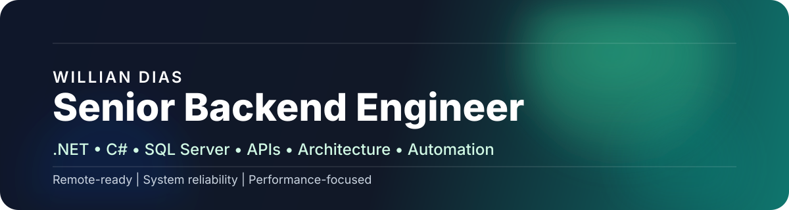

# Willian Dias

  
  
  

  <a href="https://www.linkedin.com/in/williandias01/">LinkedIn</a> •
  <a href="https://github.com/WillianDias1988/Portfolio">Portfolio</a> •
  <a href="https://github.com/WillianDias1988/cartao_WillianDias">Profile Card</a> •
  <a href="mailto:williandias01@gmail.com">Email</a>

## About

Sou engenheiro de software backend com 7+ anos de experiência, com trajetória que começou em suporte e infraestrutura e evoluiu para desenvolvimento sênior em sistemas críticos.

Atuo principalmente com C#, .NET, SQL Server, APIs REST e automação. Meu foco é construir software limpo, escalável e fácil de operar, com atenção especial a performance, testes e manutenibilidade.

Tenho experiência em ambientes de alta demanda, integração entre sistemas, otimização de banco, automação de processos e melhoria de confiabilidade operacional.

Busco oportunidades remotas ou internacionais em backend, arquitetura e engenharia de software, em times que valorizem profundidade técnica e responsabilidade sobre o produto.

## Current Focus

- backend engineering
- software architecture
- system reliability
- deployment automation
- performance tuning

## Executive Summary

- Backend engineer focused on reliability and measurable impact
- Strong in `.NET`, `C#`, `SQL Server`, APIs and automation
- Comfortable with deployment, tuning and operational ownership

## Resumo Executivo

- Engenheiro backend focado em confiabilidade e impacto mensurável
- Forte em `.NET`, `C#`, `SQL Server`, APIs e automação
- Experiência com deploy, tuning e responsabilidade operacional

## What I Do

- Backend development with `.NET` and `C#`
- SQL Server performance and database optimization
- REST API design and system integration
- Test automation and code quality
- Docker and deployment workflows
- Observability and operational improvement

## Featured Projects

- [Portfolio](https://github.com/WillianDias1988/Portfolio) - technical portfolio focused on positioning, documentation and engineering quality
- [cartao_WillianDias](https://github.com/WillianDias1988/cartao_WillianDias) - minimal profile card with a clean static presentation
- API_ScrapingB3 - backend stack with Docker, SQL Server tuning and deploy flow

## Experience Highlights

- Reduced critical task execution time by **30%** with C# automation and RPA
- Improved SQL/report performance through query and database tuning
- Increased test coverage to **80%+**
- Reduced incident resolution time by **20%**
- Supported systems used by thousands of users in high-demand environments

## Tech Stack

`C#` `.NET` `ASP.NET Core` `SQL Server` `REST APIs` `Docker` `Linux` `Azure DevOps` `GitHub Actions` `Test Automation`

## GitHub Stats

  
  

## Contact

- Email: `williandias01@gmail.com`
- Location: Osasco, SP, Brazil
- LinkedIn: [williandias01](https://www.linkedin.com/in/williandias01/)
